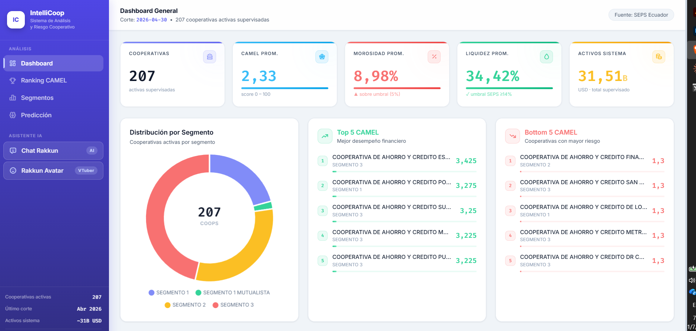
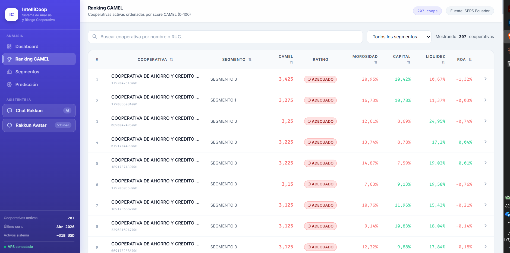
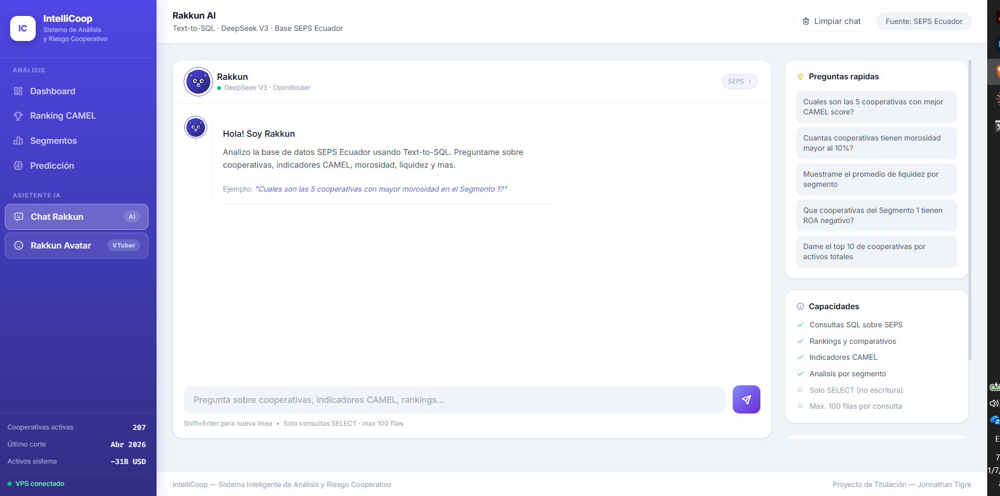
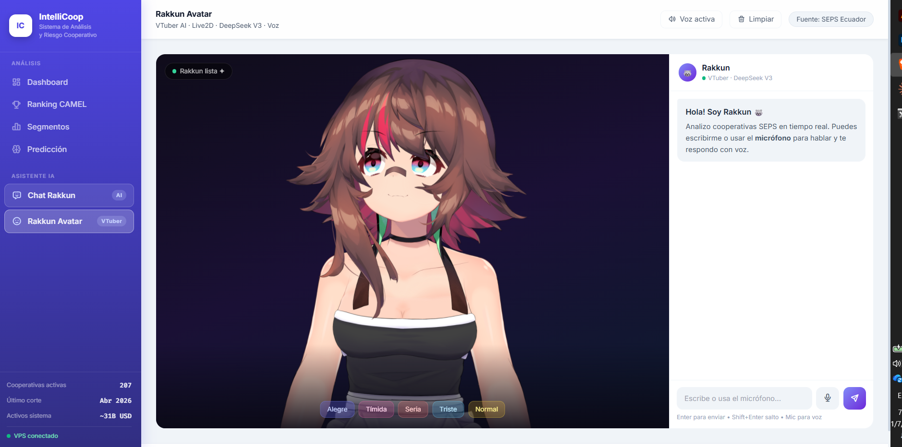

<div align="center">

# 🏦 IntelliCoop
### Sistema Inteligente de Análisis y Riesgo Cooperativo

[](https://intellicoop.lat)
[](https://python.org)
[](https://djangoproject.com)
[](https://postgresql.org)
[](LICENSE)

Aplicación web de análisis financiero para las **226 cooperativas de ahorro y crédito** supervisadas por la SEPS (Superintendencia de Economía Popular y Solidaria) del Ecuador. Incluye asistente de IA con consultas en lenguaje natural.

**Proyecto de Titulación · Carrera Big Data · 2026**

</div>

---

## ✨ Funcionalidades

| Módulo | Descripción |
|---|---|
| 📊 **Dashboard General** | KPIs del sistema: score CAMEL, morosidad, liquidez, activos totales |
| 🏆 **Ranking CAMEL** | Tabla completa de cooperativas con filtros por nombre y segmento |
| 📈 **Análisis por Segmento** | Comparativo S1 / S2 / S3 / Mutualistas con gráficos interactivos |
| 🔍 **Perfil de Cooperativa** | Historial de 24 meses por entidad con radar CAMEL y evolución |
| 🤖 **Chat Rakkun (IA)** | Consultas en lenguaje natural → SQL automático → resultados en tabla |
| 🎭 **Rakkun Avatar (VTuber)** | Asistente Live2D con voz TTS Neural, lip-sync y reconocimiento de voz |
| 🔮 **Predicción ML** | *(En desarrollo)* Clustering, alerta temprana, detección de anomalías |

---

## 🖼️ Capturas

<div align="center">

| Dashboard | Ranking CAMEL |
|:---:|:---:|
|  |  |

| Chat Rakkun IA | Avatar VTuber |
|:---:|:---:|
|  |  |

</div>

---

## 🏗️ Arquitectura

```
https://intellicoop.lat
        │
    Nginx (SSL / reverse proxy)
        │
    ┌───┴───────────────────────────┐
    │                               │
Gunicorn :8000              Uvicorn :8001
Django (seps_web)           FastAPI (rakkun_api)
        │                           │
    PostgreSQL              DeepSeek V3 (OpenRouter)
    seps_eeff               NL → SQL → Resultados
```

**Pipeline de datos:**
```
SEPS Portal (descarga .txt/.csv)
    └── consolidar_base.py
        └── DuckDB (31M filas, local)
            └── ETL → PostgreSQL (fact_indicadores, dim_cooperativa)
                └── Django → Frontend
```

---

## 🛠️ Stack tecnológico

**Backend**
- Python 3.10 · Django 4.x · FastAPI · Gunicorn · Uvicorn
- PostgreSQL 15 · DuckDB (análisis local)
- psycopg2 · pandas · scikit-learn · statsmodels

**Frontend**
- Tailwind CSS CDN · Chart.js · Tabler Icons
- Live2D Cubism SDK (pixi-live2d-display)
- Web Speech API · Google Cloud TTS Neural

**IA / ML**
- DeepSeek V3 via OpenRouter (Text-to-SQL)
- scikit-learn: PCA, K-Means, Random Forest, Isolation Forest
- statsmodels: Holt-Winters, OLS

**Infraestructura**
- DigitalOcean VPS (Ubuntu) · Nginx · Let's Encrypt SSL
- systemd services · GitHub CI/CD manual

---

## 📐 Metodología CAMEL

El sistema implementa la metodología **CAMEL** adaptada a la normativa SEPS Ecuador (pesos NCUA 2023):

| Componente | Peso | Indicador principal |
|---|---|---|
| **C** Capital | 25% | Índice de capitalización ≥ 9% |
| **A** Asset quality | 25% | Morosidad ≤ 5% · Cobertura ≥ 100% |
| **M** Management | 20% | Eficiencia operativa |
| **E** Earnings | 15% | ROA · Spread financiero |
| **L** Liquidity | 15% | Liquidez ampliada ≥ 14% |

Score compuesto 0–100 → Rating: **Sobresaliente / Bueno / Regular / Malo / Crítico**

---

## ⚙️ Instalación local

### Requisitos
- Python 3.10+
- PostgreSQL con base `seps_eeff` y tablas cargadas
- API key de [OpenRouter](https://openrouter.ai) (para Chat Rakkun)

### Pasos

```bash
# 1. Clonar el repositorio
git clone https://github.com/tigreraph/IntelliCoop.git
cd IntelliCoop/seps_web

# 2. Instalar dependencias
pip install django psycopg2-binary fastapi uvicorn openai python-dotenv

# 3. Configurar variables de entorno
cp .env.example .env
# Editar .env con tus credenciales

# 4. Recolectar archivos estáticos
python manage.py collectstatic --noinput

# 5. Iniciar Django
python manage.py runserver

# 6. Iniciar Rakkun API (otra terminal)
uvicorn rakkun_api:app --host 127.0.0.1 --port 8001
```

Abrir en el navegador: `http://127.0.0.1:8000`

### Variables de entorno (.env)

```env
SECRET_KEY=tu-secret-key-django
DEBUG=True
ALLOWED_HOSTS=localhost,127.0.0.1
DB_HOST=localhost
DB_PORT=5432
DB_USER=postgres
DB_PASS=tu-password
OPENROUTER_KEY=sk-or-v1-...
GOOGLE_TTS_KEY=AIzaSy...   # opcional, para voz en Rakkun Avatar
```

---

## 📊 Cobertura de datos

| Métrica | Valor |
|---|---|
| Cooperativas supervisadas | 226 activas |
| Segmentos | S1 (47) · S2 (57) · S3 (118) · Mutualistas (4) |
| Período histórico | 2015 – 2025 |
| Registros DuckDB | ~31 millones de filas |
| Activos totales del sistema | ~31.5 B USD |
| Último corte disponible | Abril 2026 |

---

## 🗂️ Estructura del proyecto

```
IntelliCoop/
├── seps_web/               ← Aplicación Django + Rakkun API
│   ├── core/               ← Views, URLs, context processors
│   │   ├── views.py        ← Dashboard, ranking, segmentos, detalle, chat
│   │   └── templates/      ← HTML (base + 6 páginas)
│   ├── rakkun_api.py       ← FastAPI Text-to-SQL + DeepSeek V3
│   ├── seps_project/       ← Settings, wsgi, urls raíz
│   └── static/             ← CSS, JS, Live2D assets
├── Notebooks/              ← Análisis exploratorio y CAMEL (Jupyter)
│   ├── analisis_descriptivo.ipynb
│   ├── daquilema_solvencia.ipynb
│   └── solvencia_segmento1_completo.ipynb
├── Scripts/                ← ETL y descarga de datos SEPS
│   ├── consolidar_base.py
│   └── descarga_bases_datos.py
├── docs/
│   └── DOCUMENTACION.md    ← Documentación técnica completa
└── .env.example
```

---

## 🚀 Despliegue en producción

Ver [`docs/DOCUMENTACION.md`](docs/DOCUMENTACION.md) — Sección 12 para instrucciones completas de despliegue en VPS con Nginx + Gunicorn + SSL.

---

## 📌 Notas importantes

- **Los datos crudos no están en el repositorio** (3.1 GB de archivos SEPS) — se descargan directamente del portal SEPS con `Scripts/descarga_bases_datos.py`
- **La base DuckDB** (~300 MB) tampoco está incluida — se genera con `Scripts/consolidar_base.py`
- **Los modelos ML** (`.pkl`) se transfieren al VPS por SCP, no via git

---

## 👤 Autor

**Jonnathan Tigre**  
Estudiante de Big Data · Ecuador  
Proyecto de Titulación 2026

[](https://github.com/tigreraph)

---

<div align="center">

*IntelliCoop — Sistema Inteligente de Análisis y Riesgo Cooperativo*  
*Datos: SEPS Ecuador · IA: DeepSeek V3 via OpenRouter*

</div>
